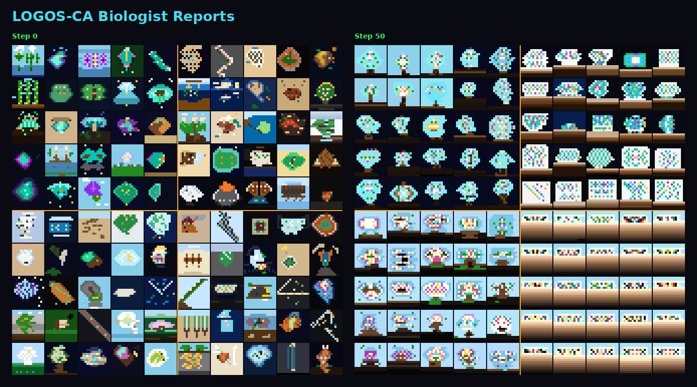

# LOGOS-CA Biologist Reports

An interactive viewer for fictitious biological field reports generated by a Large Language Model (LLM) through a cellular automaton simulation.

**[→ View Live](https://YOUR_USERNAME.github.io/YOUR_REPO_NAME/)**

## Overview

Each cell in a 10×10 grid represents a biologist's field report — complete with a title, summary, and a 16×16 pixel sketch of the observed organism or biome. At every simulation step, each report is rewritten by an LLM (GPT-5-mini) based on the previous report and those of neighboring cells.

The grid is divided into four weakly-coupled 5×5 regions, connected only through a few boundary cells. Over 50 steps, each region independently develops its own "ecological" vocabulary and visual style — an emergent island biogeography driven entirely by language.

| Region | Location | Emergent Theme |
|--------|----------|----------------|
| R1 | Top-left | Lamina — radiant leaf-like structures in montane cloud forests |
| R2 | Top-right | Mucilage — gelatinous organisms in mangrove intertidal zones |
| R3 | Bottom-left | Pulsatilis — pulsing, resonant spiral forms |
| R4 | Bottom-right | Mosaics — fog-harvesting capillary condensate systems |

> **Note:** These themes were not designed or specified by humans in any way. The only input was a neutral placeholder report identical across all cells. The themes above are labels we assigned *after the fact* to describe the tendencies that emerged spontaneously from the LLM-driven simulation.

## Background

This project extends the [LOGOS-CA](https://github.com/A5size/LOGOS-CA) framework proposed in:

> Utimula, K. (2026). **LOGOS-CA: A Cellular Automaton Using Natural Language as State and Rule.** arXiv preprint.
> [https://arxiv.org/abs/2602.00036](https://arxiv.org/abs/2602.00036)

LOGOS-CA is a cellular automaton where both cell states and update rules are described in natural language, with state transitions determined by an LLM. The original paper demonstrated this with forest fire simulations and artificial life experiments.

This project adapts the framework so that each cell state is a structured biological report (title, summary, and pixel-art sketch), and the LLM acts as a field biologist fabricating new observations influenced by nearby reports.

### Simulation Setup

- **Grid**: 10×10 (4 weakly-coupled 5×5 regions)
- **Model**: GPT-5-mini (temperature=1.0)
- **Steps**: 50
- **Neighborhood**: von Neumann (4 neighbors) with sparse cross-region connections
- **Initialization**: A shared 5×5 seed is evolved for 5 steps; different stages (steps 1–4) are assigned to the four regions, giving them a common ancestor but divergent starting points

## Usage

### Viewer Controls

| Input | Action |
|-------|--------|
| Slider / ← → keys | Switch simulation step |
| Space | Play / Pause auto-advance |
| 1x / 2x / 4x button | Change playback speed |
| Hover over cell | Preview report |
| Click cell | Pin report (click again or Esc to unpin) |

### Share

Each report can be shared via the **REPORT** buttons at the top of the detail panel:

- **𝕏 POST TO X** — copies a share card image and opens X with pre-filled text
- **☐ COPY IMAGE** — copies the share card to clipboard
- **↓ DOWNLOAD** — downloads the share card as PNG

## Files

| File | Description |
|------|-------------|
| `index.html` | Interactive viewer (single HTML file, no build step required) |
| `data.json` | Simulation data — 51 steps × 100 cells (~9.5 MB, ~2.8 MB gzipped) |

## License

The LOGOS-CA framework and original paper are by K. Utimula. See the [original repository](https://github.com/A5size/LOGOS-CA) for license details.
